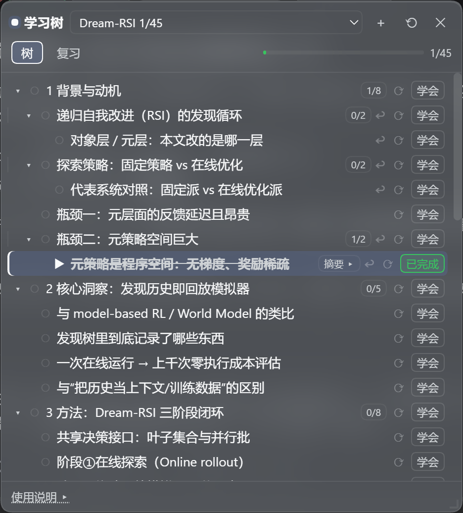
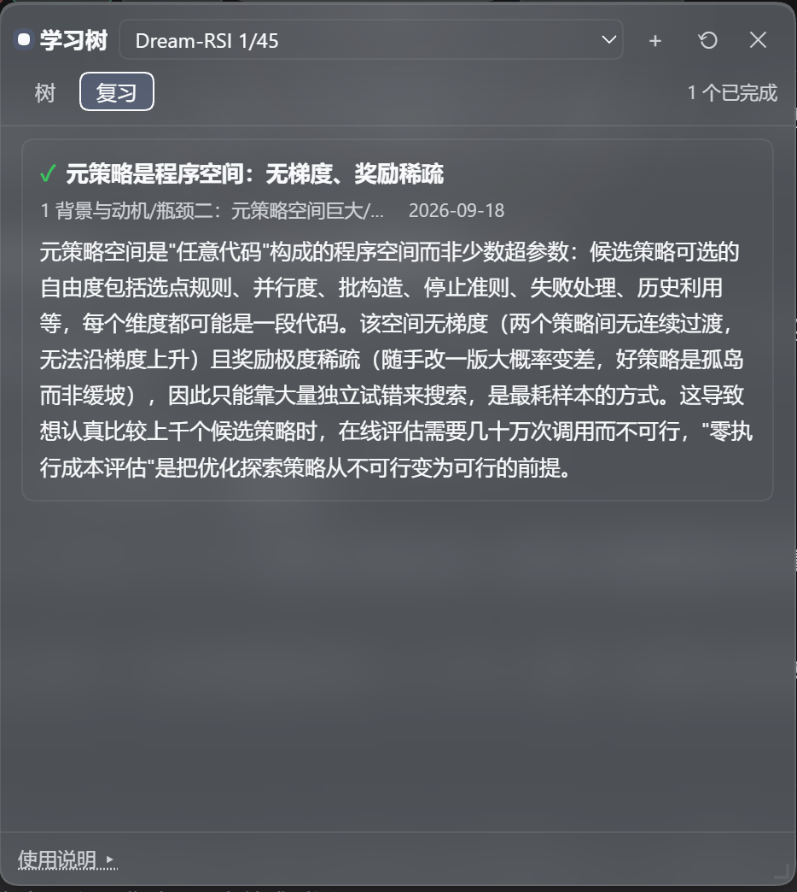

# dsh-learning-mode

给 [DSH](https://github.com/deepseek-ai/deepseek-harness)（DeepSeek Harness）用的 agent 插件：
一棵由 AI 维护、**可无限下钻的学习树**。

**语言：[中文](#中文) ｜ [English](#english)**

---

## 中文

### 这是什么

它解决一个很具体的痛点：**学习时钻进支线，回头找不到原来的位置**。

复习链表时看到「跳表」就去研究跳表，研究完要翻很久聊天记录才能回到链表；
要复习十个知识点，每学完一个都得回去找下一个。

它把「我在哪、学到哪、还剩什么」变成一棵**持久**的树：树由 AI 直接维护，
节点带自动摘要，每轮对话自动带上上下文，点一下就能跳回讲它的那一轮。



*面板浮层：可拖动 / 可调大小 / 记住你上次调的样子。右上角下拉框切树或新建；顶部一行是**整棵树的进度**
（这里 `1/45`）；每行右侧是「这一支的进度」角标与 [摘要] / [⟳ 重写摘要] / [✓ 学会]；加粗高亮那一行＝
**当前聚焦**（▶），它右边的 [↩] 能跳回讲它的那一轮对话。*

### 一个真实例子：4 轮对话，长出一棵 45 个节点的论文树

> 下面全部是**真实数据**，不是示意。树文件在 `$DSH_HOME/learning-mode/trees/dream-rsi.json`
> （树名 Dream-RSI，45 个节点、9 个顶层分支）。

| 轮 | 你说 | 插件做了什么 |
|---|---|---|
| 1 | `我要学习一下这篇论文` | AI 把论文骨架挂成一棵树：**8 个章节 + 附录**，共 9 个顶层分支 |
| 2 | `先介绍下递归自我改进（RSI）的发现循环` | 你点一下节点＝**聚焦**；AI 只讲这一个节点，讲完**静默**把顺带引入的子概念挂到它下面（`outline_capture`）——你不用说「帮我记一下」 |
| 3 | `介绍` | 你没指明对象。每轮自动注入的上下文块里已经写着「▶ 当前聚焦（用户正在看的）：递归自我改进（RSI）的发现循环」，所以 AI 接着讲的就是**那个**节点 —— 不用复述上下文，也不会讲错 |
| 4 | `介绍一下` | 继续顺着你的思路往下长 |

4 轮之后：**45 个节点**。它记录的是**你当时的思路**：你是从「瓶颈二：元策略空间巨大」往下追问的，
所以「元策略是程序空间：无梯度、奖励稀疏」就挂在**瓶颈二**下面 —— 而不是被挪到某个"教科书上更该待"
的位置。（这也是上面那条摘要的节点。）

#### 点一下 [✓ 学会]

插件**自己调模型**写一句摘要 —— **不进聊天记录**，不占你的上下文。
下面这条就是树里真实躺着的内容：

> **元策略是程序空间：无梯度、奖励稀疏**（路径：`1 背景与动机/瓶颈二：元策略空间巨大/…`）
>
> 元策略空间是「任意代码」构成的程序空间而非少数超参数：候选策略可选的自由度包括
> 选点规则、并行度、批构造、停止准则、失败处理、历史利用等，每个维度都可能是一段代码。
> 该空间无梯度（两个策略间无连续过渡，无法沿梯度上升）且奖励极度稀疏（随手改一版大概率
> 变差，好策略是孤岛而非缓坡），因此只能靠大量独立试错来搜索……（原文 225 字，此处截断）

摘要不对可以点 [⟳] 让模型重写。



*[复习] 页签：所有已完成知识点 + 摘要集中一处，不用翻聊天记录。*

#### 每个知识点都记着「它是在哪轮对话里讲到的」

这棵树里有 6 个节点带着来源坐标；点行上的 [↩] 就切回那次会话、滚到那一轮并高亮 ——
**钻进去学完，一键回到原位**。

### 它还能做什么

- **树是持久的**：今天学 Java，明天开新会话继续，树还在（可以有多棵树）。
- **AI 直接往树里写**：你说「我要学 X，要学什么」，清单就长出来了，不用手抄。
- **无限下钻**：对着「对象」再问一句，继承 / 私有 / 面向对象思想就挂到它下面。
- **每轮对话自动带上**「我在哪 + 这一层的摘要 + 还没学完什么」（不用你复述上下文）。
- **标 [✓ 学会] 时插件自己调模型写一句摘要**（不进聊天记录，省上下文），复习页签集中读。
- **点 [↩] 跳回讲它的那一轮对话**。
- 面板是**玻璃浮层**，可以拖动 / 调大小，并且**记住你上次调的样子**。
- **零侵入**：普通会话里不显示任何东西 —— 只有挂了「学习模式」预设的会话才有入口。
- **跟随 DSH 的语言**：面板文案、每轮注入给模型的指令、工具描述、摘要提示词都按 DSH
  当前语言走（中文 / English）；语言改了下一次调用就生效，不用重装。

### 仓库结构

| 路径 | 内容 |
|---|---|
| `dsh-learning-mode/` | **插件本体**：宿主半边 + 浏览器半边 + 测试 + 安装脚本 |
| `继续开发说明.md` | 开发台账：每轮做了什么 + 19 个**真实踩过的坑**（含根因与判据） |
| `设计文档/` | 方案 v1/v2、插件全貌与运行时对齐、调研报告 |
| `预设参考/` | 生成的 agent 预设（`agent.cordis.yml`），可对照 |
| `数据备份（可选）/` | 教程树的数据备份（示例数据） |

想直接看实现细节和每个坑，读 `dsh-learning-mode/README.md` 与 `继续开发说明.md`。

### 装起来（5 步）

前置：DSH 已装好能跑（`dsh web`），Node 18+。

```bash
cd dsh-learning-mode

# 1. 建依赖 junction：把 harness 的 @deepseek-ai 包「借」给本插件
node scripts/link-harness-deps.mjs

# 2. 自检（七套，含探针；全绿再往下走）
npm test

# 3. 生成 agent 预设（复制底预设 + 追加插件行 + 逐行校验）
node install.mjs standard

# 4. 注册进 profile（dependencies + bundles + junction，幂等）
node scripts/setup-profile.mjs

# 5. 重启 dsh web，刷新页面，新建会话时选「学习模式」
```

> ⚠️ **`node_modules/` 故意没有进仓库**：它是指向本机 harness 安装目录的软链
> （`node_modules/@deepseek-ai` → dsh 的包目录），换了机器必须重新跑第 1 步。
> 脚本会自动探测 DSH 安装位置；探测不到时用环境变量指定：
> `DSH_HOME`（默认 `~/.dsh`）、`DSH_PROFILE`（默认 `web`）、`DSH_CHECKOUT`（dsh 包目录）。

### 自检与运维脚本

| 命令 | 作用 |
|---|---|
| `npm test` | **七套断言**：数据层 / 宿主集成 / 摘要管道 / 浏览器渲染 / i18n 完整性 / 英文行为 / 探针 |
| `npm run verify:live [会话id前缀]` | **真机核查**：直接解多帧 zstd 会话日志，核对「每轮注入真的在不在」「开发向工具是否已屏蔽」（中英文注入都认） |
| `npm run backfill:origins` | 回填来源坐标（扫会话日志里的 `outline_capture`/`outline_add` 调用；默认 dry-run，`--write` 才写盘并备份） |
| `npm run validate:preset` | 逐行校验预设里每个 specifier 能否解析 |

### 设计上的两条硬约束

1. **零侵入**：插件只挂在「学习模式」预设里，普通会话连按钮都不渲染。
2. **失败不许静默**：面向模型的功能一旦静默失败，界面上和「正常工作」长得一模一样
   —— 这个项目为此栽过两次（见 `继续开发说明.md` 坑 13）。
   所以关键步骤都往 `$DSH_HOME/learning-mode/rpc.log` 留判据
   （`inject diag` / `origin diag` / `jump …` / `env …` / `locale …`）。

### 状态

个人项目，跟着本机 DSH 版本走（peer dependency：`@deepseek-ai/cordis ^4.0.1`）。
`lib/` 是手写的普通 JavaScript（没有构建步骤、没有 TypeScript）。

### 许可

MIT，见 `LICENSE`。

---

## English

### What it is

An agent plugin for [DSH](https://github.com/deepseek-ai/deepseek-harness) (DeepSeek Harness):
a **learning tree** that the AI maintains for you and that you can drill into without limit.

It solves one very concrete pain: **while studying you wander into a side branch, and afterwards
you cannot find your way back.**

You are reviewing linked lists, you see "skip list", you go study skip lists — and when you are done
you have to scroll a long way through the chat to get back to linked lists. Or you want to review ten
topics, and after each one you have to go hunting for the next.

The plugin turns "where am I, what have I learned, what is left" into a **persistent** tree:
the AI writes into it directly, every node carries an auto-generated summary, each turn is
automatically given the right context, and one click takes you back to the turn that taught a node.


*A frosted-glass panel: drag it, resize it, and it remembers your last layout. The dropdown in the
top right switches or creates trees; the row under the tabs is the **whole tree's progress**
(`1/45` here); each row carries a "this branch's progress" badge plus
`[摘要] / [⟳ rewrite] / [✓ 学会]`; the highlighted row is the **current focus** (▶), and the [↩] next to
it jumps back to the conversation turn that taught it.*

> The screenshots on this page show the UI in Chinese because DSH is set to Chinese on this machine.
> Every string in the panel — and in the model-facing instructions — is localised and follows DSH's
> language setting (see "Follows DSH's language" below).

### A real example: 4 turns produced a 45-node tree for one paper

> Everything below is **real data**, not an illustration. The tree file is
> `$DSH_HOME/learning-mode/trees/dream-rsi.json` (tree "Dream-RSI": 45 nodes, 9 top-level branches).

| Turn | You said | What the plugin did |
|---|---|---|
| 1 | `我要学习一下这篇论文` ("I want to study this paper") | The AI attached the paper's skeleton as a tree: **8 sections + appendix**, 9 top-level branches |
| 2 | `先介绍下递归自我改进（RSI）的发现循环` ("first explain the RSI discovery loop") | Clicking a node **focuses** it; the AI explained only that node and then **silently** attached the sub-concepts it introduced under it (`outline_capture`) — you never have to say "please take a note" |
| 3 | `介绍` ("explain it") | You named nothing. The context block that is injected every turn already said `▶ 当前聚焦（用户正在看的）：递归自我改进（RSI）的发现循环`, so the AI explained **that** node — **no restating of context, no drift** |
| 4 | `介绍一下` | The tree kept growing along your train of thought |

After 4 turns: **45 nodes**. It records **the path your thinking actually took**: because you dug
down from "瓶颈二：元策略空间巨大" (*bottleneck two: the meta-policy space is huge*), the sub-topic
"元策略是程序空间：无梯度、奖励稀疏" (*the meta-policy is a program space*) hangs **under bottleneck
two** rather than wherever a textbook outline "should" put it. (That is the node whose summary is
quoted below.)

#### What clicking [✓ 学会] ("learned") does

The plugin **calls the model itself** to write a one-line summary — it **never enters the chat
history**, so it does not consume your context. This one is really sitting in the tree:

> **元策略是程序空间：无梯度、奖励稀疏** (*the meta-policy is a program space: no gradient, sparse reward*)
>
> The meta-policy space is a program space made of arbitrary code rather than a handful of
> hyper-parameters: the degrees of freedom include the point-selection rule, parallelism, batch
> construction, stopping criteria, failure handling and history use — each of them can be a piece of
> code. That space has no gradient (no continuous transition between two policies) and extremely
> sparse reward (a random edit most likely makes things worse; good policies are islands, not gentle
> slopes), so it can only be searched by massive independent trial and error…
> *(225 characters in the original; truncated here.)*

If a summary is wrong, click [⟳] to have the model rewrite it.


*The [复习] (Review) tab: every learned topic and its summary in one place — no scrolling the chat.*

#### Every topic remembers which turn taught it

Six nodes in this tree carry an origin coordinate; clicking [↩] on the row switches back to that
conversation, scrolls to that turn, and highlights it — **drill in, then return in one click.**

### What else it does

- **The tree persists**: study Java today, open a new session tomorrow and the tree is still there
  (you can have several trees).
- **The AI writes into the tree directly**: say "I want to learn X, what should I learn" and the list
  appears — no manual copying.
- **Unlimited drilling**: ask another question about "objects" and inheritance / private members /
  OOP thinking hang underneath it.
- **Every turn is automatically given** "where I am + this level's summary + what is left"
  (you never restate context).
- **Clicking [✓ 学会] makes the plugin call the model for a one-line summary** (not in chat history,
  saving context); the Review tab collects them.
- **Clicking [↩] jumps back to the turn that taught the node.**
- The panel is a **frosted-glass overlay**: draggable, resizable, and it remembers your last layout.
- **Zero intrusion**: nothing shows up in ordinary sessions — only sessions that mount the
  "learning mode" preset have an entry point.
- **Follows DSH's language**: panel copy, the per-turn model instructions, tool descriptions and the
  summary prompt all follow DSH's current language (Chinese / English). Change the language and the
  next call uses it — no reinstall.

### Repository layout

| Path | Contents |
|---|---|
| `dsh-learning-mode/` | **The plugin itself**: host half + browser half + tests + install scripts |
| `继续开发说明.md` | Development log: what each round did + 19 **real pitfalls** (root cause and evidence) |
| `设计文档/` | Design docs v1/v2, plugin overview & runtime alignment, research report |
| `预设参考/` | The generated agent preset (`agent.cordis.yml`) for reference |
| `数据备份（可选）/` | A data backup of the tutorial tree (sample data) |

For implementation details and every pitfall, read `dsh-learning-mode/README.md` and
`继续开发说明.md` (both in Chinese).

### Install (5 steps)

Prerequisites: DSH installed and runnable (`dsh web`), Node 18+.

```bash
cd dsh-learning-mode

# 1. Create the dependency junction: "borrow" the harness's @deepseek-ai packages
node scripts/link-harness-deps.mjs

# 2. Self-check (seven suites, probe included; all green before you continue)
npm test

# 3. Generate the agent preset (copy the base preset + append the plugin row + validate every row)
node install.mjs standard

# 4. Register into the profile (dependencies + bundles + junction; idempotent)
node scripts/setup-profile.mjs

# 5. Restart dsh web, refresh the page, and pick "学习模式" when creating a session
```

> ⚠️ **`node_modules/` is deliberately not committed**: it is a link to the harness installation on
> this machine (`node_modules/@deepseek-ai` → dsh's package directory), so on a new machine you must
> re-run step 1. The scripts auto-detect the DSH install; if detection fails, set `DSH_HOME`
> (default `~/.dsh`), `DSH_PROFILE` (default `web`) or `DSH_CHECKOUT` (the dsh package directory).

### Self-check and operations

| Command | Purpose |
|---|---|
| `npm test` | **Seven suites**: data layer / host integration / summary pipeline / browser rendering / i18n completeness / English behaviour / probe |
| `npm run verify:live [sessionIdPrefix]` | **Live verification**: decodes the multi-frame zstd session log and checks that the per-turn injection really happened and that developer-facing tools are hidden (recognises both Chinese and English injections) |
| `npm run backfill:origins` | Backfill origin coordinates (scans the session log for `outline_capture`/`outline_add` calls; dry-run by default, `--write` to persist with a backup) |
| `npm run validate:preset` | Validate that every specifier in the preset resolves |

### Two hard design constraints

1. **Zero intrusion**: the plugin is mounted only by the "learning mode" preset; ordinary sessions do
   not even render the button.
2. **Failures must not be silent**: when a model-facing feature fails silently, it looks exactly like
   normal operation — this project got burned by that twice (see pitfall 13 in `继续开发说明.md`).
   So the critical steps leave evidence in `$DSH_HOME/learning-mode/rpc.log`
   (`inject diag` / `origin diag` / `jump …` / `env …` / `locale …`).

### Status

A personal project, tracking the local DSH version (peer dependency: `@deepseek-ai/cordis ^4.0.1`).
`lib/` is hand-written plain JavaScript — no build step, no TypeScript.

### License

MIT, see `LICENSE`.
