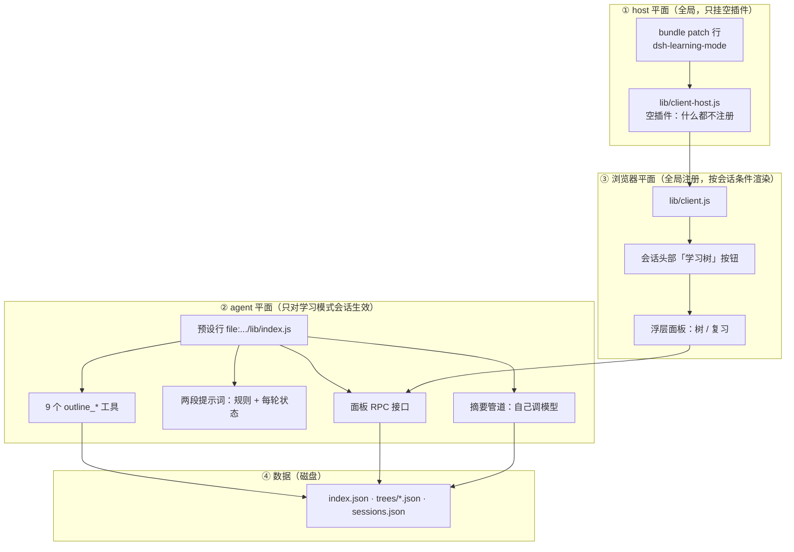
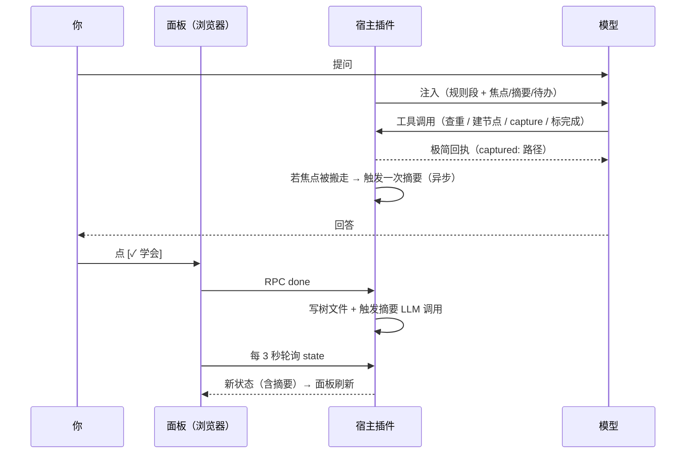
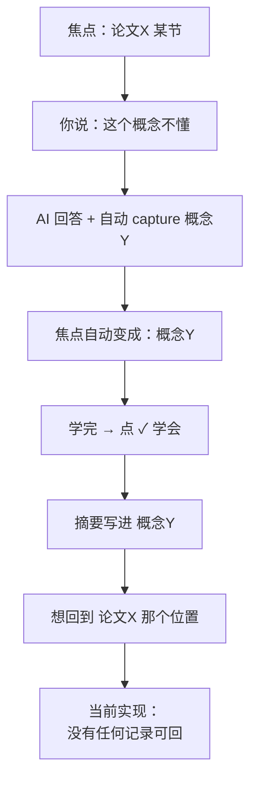

# 学习模式插件 · 全貌与运行时对齐（当前实现 v0.2）

> 目的：把"这个插件是什么形态、由哪些部分组成、一轮对话里谁做了什么、数据长什么样"讲清楚，
> 便于你指出**我的描述与你的理解**在哪里不一致。本文只描述**现在的实现**，不含提案。
>
> 生成时间：2026-09-18 ｜ 对应代码：`dsh-learning-mode-portable/dsh-learning-mode/`
>
> ⚠️ **更新（第五轮，2026-09-18）**：§5 表格里"摘要原料的起点 = `focusSince`"与 §6 的
> "输入 = 节点路径 + 已有摘要 + `focusSince` 之后的片段"**已过时**。现在的规则是：
> 窗口 = 该节点 `lastEnteredAt` →（没进过时）最近进过的祖先 → 节点 `createdAt` 三级兜底；
> 原料再按节点标题**收窄到命中的小节**；提示词附带同层其它知识点作排除项。
> 触发只剩"点 ✓"与面板 ⟳ 两条（三条 blur 早已删除）。
> 出问题的真机案例与修法见 `继续开发说明.md` 第五轮。

---

## 0. 一句话概括

> 它是一个**挂在「学习模式」agent 预设里的宿主插件**（提供工具 + 每轮注入 + 摘要），
> **外加一个全局注册的浏览器浮层面板**（会话头部一个「学习树」按钮），
> 树的数据存在磁盘上的 3 个 JSON 文件里，由**模型通过工具**写、由**你点按钮**确认。

关键点：**插件本体没有自己的页面**。你在界面上能看到的只有两处：会话头部那个「学习树」按钮，和点开后右上角的浮层。

---

## 1. 形态：一个包，三个平面



### 为什么拆成三块（这是理解"插件形式"的关键）

| 平面 | 文件 | 为什么要这样 |
|---|---|---|
| ① host 平面 | `lib/client-host.js`（空插件） | 浏览器半边由 `dsh-client-modules` 扫描"host Loader 已挂载的、声明了 `dsh.client` 的包"来加载。所以必须在本包 root 挂一个 host 行——**但只有空插件**，否则 9 个工具会出现在所有会话里 |
| ② agent 平面 | `lib/index.js` | 真正的功能。写进「学习模式」预设的 `agent.cordis.yml`（用 `file:` 绝对路径），**只有用这个预设的会话才有** |
| ③ 浏览器平面 | `lib/client.js` | 全局加载（代码常驻所有会话），但拿到 `enabled !== true` 时 **render null** ⇒ 普通会话里什么都不出现 |

> 推论 1：**开启方式只有一种——新建会话时选「学习模式」预设**。不存在"中途开启"，普通会话里连工具都不存在（不是"存在但拒绝调用"）。
> 推论 2：**改 host 代码（`lib/index.js` / `store.js` / `summary.js`）必须重启 dsh web 才生效**；
> 改浏览器半边（`lib/client.js`）刷新页面即可。

---

## 2. 数据：只有 3 个文件

位置：`$DSH_HOME/learning-mode/`

### 2.1 `index.json` —— 树清单

```json
{ "trees": [ { "id": "tutorial", "title": "如何使用学习模式",
               "createdAt": "...", "lastUsedAt": "..." } ],
  "lastUsed": "tutorial" }
```

### 2.2 `trees/<id>.json` —— 一棵树（一树一文件）

```jsonc
{ "id": "tutorial", "title": "如何使用学习模式", "createdAt": "...",
  "nodes": [ {
    "id": "n3f8a1",            // 节点唯一 id（面板点选靠它，标题含 `/` 也不怕）
    "title": "插入/删除",       // 显示名，**可以含 `/`**
    "status": "todo",          // todo | done
    "note": "",                // 摘要正文（复习时看的就是它）
    "noteAt": null,            // 摘要生成时间
    "noteState": null,         // null | running | done | skipped | failed
    "noteTries": 0,            // 摘要失败累计次数（≤3）
    "noteError": null,         // 最近一次失败原因（面板 hover 可见）
    "noteSource": null,        // 摘要原料窗口 { sessionId, from, to, reason }
    "doneAt": null,            // 标记完成的时间
    "children": []             // 嵌套子树（不是扁平表）
  } ] }
```

### 2.3 `sessions.json` —— 每个会话的绑定与焦点

```jsonc
{ "session-d6a177ca-...": {
    "enabled": true,                                   // 面板据此决定显不显示
    "treeId": "数据结构",                               // 这个会话在看哪棵树
    "focus": "链表/快慢指针：中点、环检测、找环入口",        // ★ 焦点 = 一个字符串
    "focusSince": "2026-09-18T01:54:36.733Z"           // ★ 进入该焦点的时间
  } }
```

### 2.4 `rpc.log` —— 诊断日志（每 3 秒轮询也记一行）

---

## 3. ★ 焦点（focus）到底是什么 —— 很可能是我们理解不一致的地方

**当前实现里，"焦点"就是一个会话一个字符串，没有栈、没有历史、没有"上一个"。**

| 你以为的（？） | 实际是 |
|---|---|
| 聚焦 = 进入某个知识点，回来时能回到原处 | 聚焦 = **把注入块和"下一问的中心"指向某个节点**；换掉就换掉了 |
| 插件记得我访问过的路径 | **不记**。点 A 再点 B，A 只留在 `previous` 这个**当次调用的临时返回值**里（用来触发一次摘要），不落盘 |
| 有"返回上一层/上一处" | **没有**。要用的话得**新增数据结构**（焦点栈）——这就是我上一轮说"返回是新能力"的原因 |
| 焦点只有我点才会变 | **不是**：AI 调 `outline_capture`（无感整理）也会把焦点搬到新节点，AI 调 `outline_focus` 也会 |

焦点的**两个实际用途**：

1. **每轮注入块的中心**：`▶ 当前聚焦（用户正在看的）：<focus>` + 【当前节点摘要】+【子节点摘要】+【这一层还没学完】
2. **摘要原料的起点**：`focusSince` 之后的消息才作为摘要的输入（如果被总结的节点不是当前焦点，就退化成"整场会话"）

---

## 4. 谁做什么（职责边界）

| 角色 | 负责 |
|---|---|
| **你** | 提问；点节点标题＝聚焦；点 `[✓ 学会]`；点 `[⟳]` 重写摘要；点 `[复习]`；顶部下拉切树 / `[＋]` 新建树；说"改结构" |
| **AI（模型）** | 回答问题；建树/补节点 `outline_add`；**就地挂新知识点 `outline_capture`**（自动、不向你报告）；说"学完了"时 `outline_done`；改结构 `outline_update`；查重 `outline_show`；复习 `outline_review` |
| **插件·宿主半边** | 存数据到 3 个 JSON；**每步组装注入块**；会话建立时标记 enabled + 绑定上次的树；**写摘要**（只有 ✓ 和 ⟳ 两条路，见 §6）；提供 RPC |
| **插件·浏览器半边** | 显示「学习树」按钮与浮层；每 3 秒轮询状态；把你的点击转成 RPC 请求 |

**注意**：插件**不会自己去读聊天内容建树**。树上的每个节点都是模型显式调用工具写进去的（"无感"是指不打扰你，不是插件偷听）。

---

## 5. 一轮对话的完整时序



**每次工具调用都要多走一个 model step**（模型先决定调工具、拿到结果再继续）。
实测你「数据结构」那个会话：第 1 轮 **10 步**、第 4 轮 **8 步**——这是延迟的主要来源。

---

## 6. 摘要：现在的触发规则（你要改的就是这里）

| # | 触发 | 备注 |
|---|---|---|
| 1 | 面板点 **[✓ 学会]**（没有人工 note、原本也没有摘要） | 你想保留的 |
| 2 | AI 调 `outline_done`（同上条件） | 你想保留的 |
| 3 | 面板点别的节点（焦点切走） | blur |
| 4 | AI 调 `outline_focus`（焦点切走） | blur |
| 5 | **AI 调 `outline_capture` 把焦点搬走** | blur（最隐蔽：你问一句，插件自动挂节点+搬焦点，就顺手总结上一个节点） |
| 6 | 面板点 **[⟳]** | 手动、强制、跳过冷却 |

生成方式：**插件自己调 `ctx.llm`**（不进聊天记录、不占 Agent 轮次）。
输入 = 节点路径 + 已有摘要 + `focusSince` 之后的对话片段（截 6000 字符）。
门槛：≥4 条消息 或 ≥200 字；同节点 5 分钟冷却；失败 ≤3 次。
**实测耗时 10.5~26.6 秒**（且当前默认模型 qianwen 不支持我传的 `reasoningEffort: off`，会先失败一次再回退）。

---

## 7. 每轮注入块（当前形态）

```
## 学习模式
学习树：数据结构 ｜ ▶ 当前聚焦（用户正在看的）：链表/快慢指针
【当前节点摘要】<焦点节点的 note，裁 120 字符>
【子节点摘要】
  · x：<裁 120 字符>
【进度】已完成 3/44
【这一层还没学完】插入/删除、反转链表       ← 只给"焦点子节点 + 兄弟"
【最近完成】数组（09-18）、链表（09-17）
（复习用 outline_review 读摘要清单）
（用户没指明对象时＝上面那个"当前聚焦"；答完静默把新知识点 outline_capture 到聚焦节点下）
```

硬上限 **1200 字符**，超了按这个顺序砍：子摘要 6→3→1→0 → 未完成 8→4→2→0 → 最近完成 3→2→1→0 → 两个提示行 → 单条裁 120 → 硬切。
另有**静态规则段**（约 700 字符，每次请求都在）：静默整理协议 + 7 条常规规则。

---

## 8. 例子走法

### 例 A：数据结构 —— 发散式下钻（你已经用过的路径）

| 步骤 | 你做什么 | 插件/AI 做什么 | 数据变化 | 面板 |
|---|---|---|---|---|
| 1 | 新建会话选「学习模式」 | 标记 `enabled=true`，绑定上次的树 | `sessions.json` 写入 | 头部出现「学习树」 |
| 2 | 说"我要复习数组和链表" | 查重 → `outline_add` 建/补节点 | `数据结构.json` 多出节点 | 树出现 |
| 3 | 点「数组」（或说"聚焦数组"） | 写 `focus=数据结构/数组` | `focusSince` 更新 | 该行高亮 |
| 4 | 问"数组在内存里怎么放？" | 回答 + `outline_capture("计算机地址")` | 「计算机地址」挂在**数组**下面；焦点变成它 | 树里多出一层，高亮跳到新节点 |
| 5 | 继续问地址怎么编 | 挂在**计算机地址**下面 | 再深一层 | 高亮继续下移 |
| 6 | 点 `[✓ 学会]` | 写 `status=done` + 触发生成摘要 | 节点带 `note` | 划线 + 摘要出现（10~30s 后） |
| 7 | 想回头问数组的别的事 | **没有返回按钮**；只能手动再点「数组」 | 焦点被覆盖，`focusSince` 重置 | 高亮跳回 |

> 第 7 步就是问题所在：**回去只能"再点一次"，没有"返回"**，而且中间那段的"上次焦点"不落盘。

### 例 B：论文阅读 —— 钻进去、学完、回来（你描述的场景）



现状按时间顺序：

1. 焦点在「论文X/某节」→ `focusSince = T1`
2. 你说"这个概念不懂" → AI 回答 → `outline_capture("概念Y")` 挂到「某节」下面，**并把焦点搬到概念Y**（`focusSince = T2`）
3. ⚠️ 焦点被搬走 → 触发一次**对「某节」的 blur 摘要**（这正是你说的"不应该总结我之前还没学完的内容"）
4. 你在概念Y 下继续问，节点往下长
5. 点 `[✓ 学会]` → 概念Y 得到摘要（**这一步的原料窗口是对的**：从 T2 起）
6. 想回「论文X/某节」：**只能自己再点一次那个节点**，或让我(AI)调 `outline_focus`
   - 点回去之后，注入块恢复到那一段的上下文（这一步是自动的，因为注入块跟焦点走）
   - 但如果**先点回去、再给概念Y 标 ✓**，摘要窗口会退化成"整场会话"（因为那时 `focusSince` 已经是「某节」了）

---

## 9. 我们可能理解不一致的 7 个点（请指认）

1. **"聚焦"是移动还是下钻？** 现在是"移动"（一个字符串），不是"下钻"（没有栈）。
2. **"返回原来的地方"** 我以为要新增数据结构（焦点栈/历史）；你是不是认为**树本身就是路径**、点那个节点就等于返回？（对我来说这两件事一样，只是"谁记住"的区别）
3. **插件会不会自己记笔记？** 不会。树全靠模型调工具写；插件只负责存 + 注入 + 摘要。
4. **"无感整理"是谁在做？** 是**模型**在每轮答完后调用 `outline_capture`（提示词驱动），不是插件在后台偷看聊天。
5. **面板在哪儿？** 只有会话头部一个按钮 + 右上角浮层；没有原生右侧页签，也没有独立页面。
6. **摘要触发**：现在是 6 条触发（含三条 blur）；你想要只留"点学会"。
7. **一轮的耗时** 主要是模型往返次数（一轮 4~10 步），不是面板刷新；面板的延迟是"点击后最多 3 秒才看到变化"。

---

## 10. 当前"能做 / 不能做"清单（避免期待错位）

| 能做 | 不能做（现在） |
|---|---|
| 多棵树、无限层级、切树/新建树（面板下拉） | 删除整棵树（只能删节点，且要靠跟 AI 说） |
| 面板点标题聚焦、点 ✓ 完成、点 ⟳ 重写摘要 | 面板改名/挪动/删除节点（要靠跟 AI 说 `outline_update`） |
| [复习] 页签列出已完成 + 摘要 | 按时间/标签筛选复习、间隔重复提醒、导出 Markdown |
| 每轮自动注入焦点 + 摘要 + 本层待办 | 整棵树的注入（只在 AI 调 `outline_show` 时给） |
| 自动写摘要（点 ✓ / ⟳） | **返回上一层**（没有焦点栈） |
| 标题含 `/` 的节点（面板走 id，工具走最长段解析） | 原生右侧页签（现在是浮层） |
